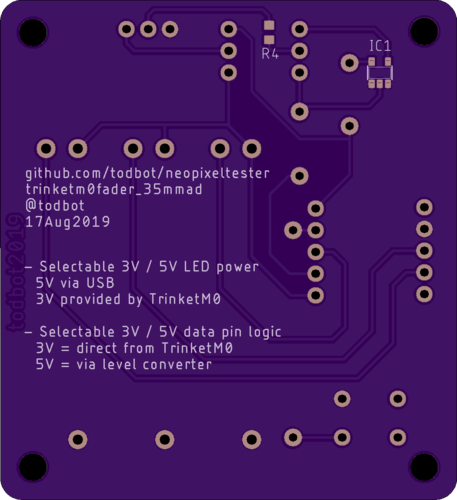

# NeopixelTester

Some testing hardware for Neopixels (WS2812, SK6812)

In this repo:
- boards - schematic in Eagle format
- sketches - Sketches to run on Trinket M0

https://youtu.be/KODPj4VacQQ

Boards available on OSHPark:
https://oshpark.com/shared_projects/BqFE6DLx

Bill of materials:
- Adafruit Trinket M0
- Adafruit 35mm slide pots x 3
- 74AHCT1G125DBV or SN74LV1T125DCKR level-shifter in SOT23-5 package
- 500 ohm resistor in 0603 package
- tact switch button
- male header pins, cut to length
- female header sockets, cut to length

Or if you're interested in the [60mm Amazon faders](http://amzn.com/B07PNDLKQQ?tag=todbotblog-20) on the other board.
And here's the [USB power meter](http://amzn.com/B07DK6FT4Q?tag=todbotblog-20) I showed in the video.
