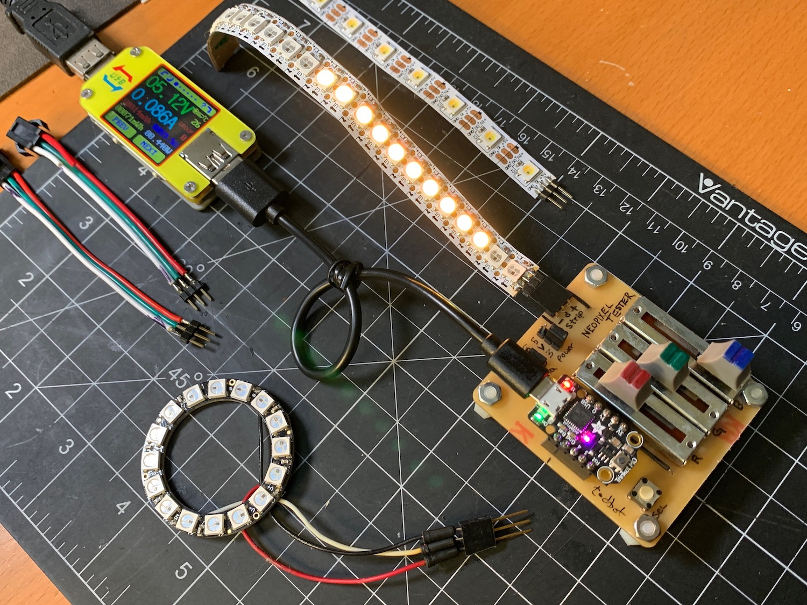
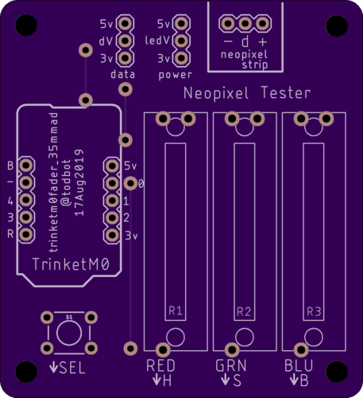

# NeopixelTester

Some testing hardware for Neopixels (WS2812, SK6812)

In this repo:
- boards - schematic in Eagle format
- sketches - Sketches to run on Trinket M0

Boards available on OSHPark:
https://oshpark.com/shared_projects/BqFE6DLx

